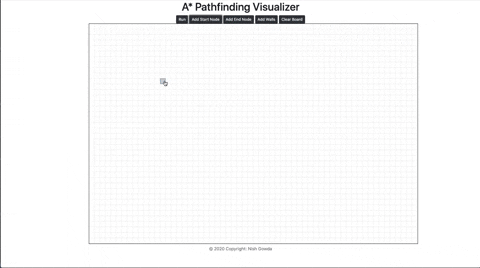
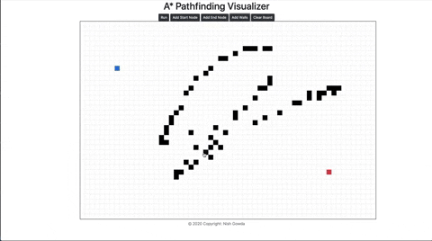

# A-Star-Pathfinding-Visualizer
 An interactive web app in Javascript and JQuery that visualizes the A* Pathfinding algorithm to find the closest path between two nodes.
 View the live demo at: https://nishgowda.github.io/A-Star-Pathfinding-Visualizer/

## Controls:
- Add a start and end node by clicking on the respective buttons on the canvas
- Click on the "Add Walls" button to start drawing walls on the map 
- While adding walls, you can also delete them from the canvas by holding shift and clicking on a wall
- To clear the board, just hit the "Clear Board button"

## Diagonals:
My algorithm supports diaganol pathfinding, allowing it to find the fastest path even faster.

## Have fun!
Now that you know the functionality, feel free to go crazy and draw whatever kind of mazes you can think of! If you find any bugs or issues feel free to leave an issue or a pull request.

*A project by Nish Gowda*
